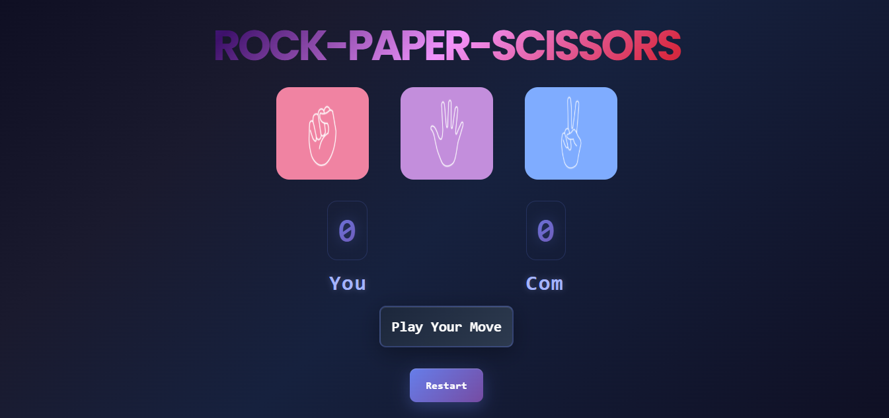

# Rock Paper Scissors Game

A fun and interactive Rock-Paper-Scissors game built using **HTML**, **CSS**, and **JavaScript**. Challenge the computer, test your luck, and enjoy a clean, responsive design with dynamic score tracking.

##  Screenshot

## Features

-  Computer randomly selects Rock, Paper, or Scissor
-  User clicks their choice through intuitive UI
-  Displays clear result: Win, Lose, or Draw
-  Scoreboard updates live for both User and Computer
-  Restart button resets the game instantly
-  Color-coded results for better user experience
-  Clean, minimal UI (mobile-friendly)

## How It Works

- JavaScript listens for user clicks on choice images.
- A random function determines the computer's move.
- Conditions check the outcome.
- The message and scores are updated on the screen accordingly.

## Developer's Journey

This project was an important step in my JavaScript learning journey.

### What I Learned
- DOM manipulation and event handling
- Improving UX with instant visual feedback
- Structuring reusable and maintainable code

This project boosted my confidence and proved I could build something functional using only core web technologies.